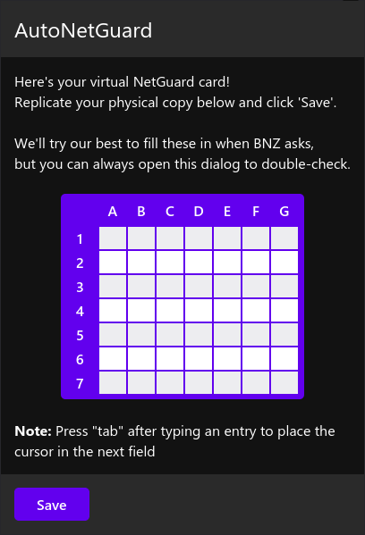

# AutoNetGuard
A Firefox extension that automatically enters NetGuard credentials when prompted on bnz.co.nz

## Screenshot


## Building from source
### Requirements
- Node JS
- npm
- Browserify

### Build
In the root directory, perform the following:

```bash
make build
```

This will place a .zip file in `target/`